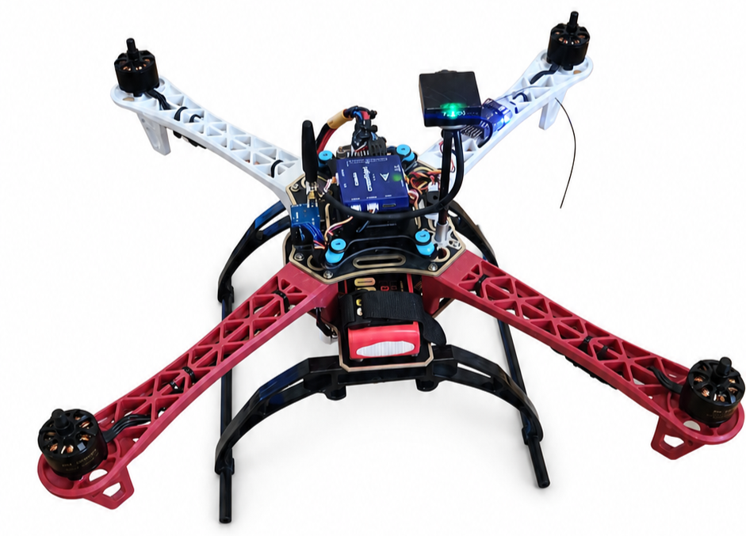
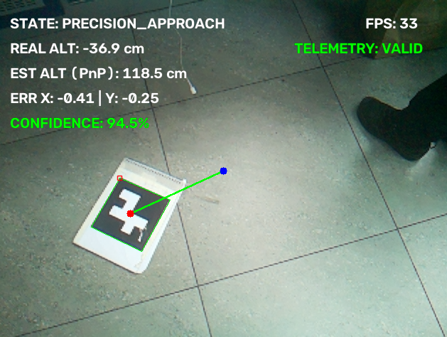

# Vision-Based Autonomous Landing System for UAVs

A proof-of-concept autonomous landing system for a quadcopter using onboard computer vision, ArUco marker detection, pose estimation, and MAVLink communication with an ArduPilot-based flight controller.

<p align="center">
  
</p>

The project was developed as a final-year Electrical Engineering project at **Afeka – Tel Aviv Academic College of Engineering**. Its goal is to demonstrate a low-cost, onboard approach for autonomous UAV landing in environments where GPS/GNSS may be unavailable, degraded, or unreliable.

---

## Demo & Flight Test

The complete system was integrated on an F450 quadcopter and tested in real outdoor flight conditions. During the autonomous landing tests, the onboard vision system detected the landing marker, estimated its relative position, and provided landing-target information to the flight controller through MAVLink.

<p align="center">
  <a href="media/autonomous_landing_demo.mp4">
    
  </a>
</p>

**[▶ Watch the autonomous landing demo](media/autonomous_landing_demo.mp4)**

The GUI shown above provides real-time visibility into the landing process, including:

- current landing state
- flight-controller altitude telemetry
- vision-estimated distance to the target using PnP
- normalized X/Y positioning error
- detection confidence
- processing frame rate (FPS)
- telemetry validity

> The video shows one of the real autonomous landing tests performed during project validation. No formal landing-accuracy figure is claimed here; the project focused on demonstrating the complete perception-to-flight-control pipeline in real operation.

---

## Project Overview

Manual UAV landing can become difficult in GPS-denied environments, communication-limited areas, or situations with poor operator visibility. High-accuracy alternatives such as RTK-GPS and LiDAR can add cost, weight, infrastructure requirements, or integration complexity.

This project explores a self-contained vision-based alternative built around:

- **Raspberry Pi 4** companion computer
- downward-facing **RGB camera**
- **OpenCV** image processing
- **ArUco** visual markers
- camera calibration using a checkerboard target
- **Perspective-n-Point (PnP)** pose estimation
- **MAVLink** communication with the flight controller
- real-time telemetry validation
- state-based landing logic and fail-safe handling
- CSV flight-data logging for post-test analysis

---

## System Architecture

The system is divided into three main functional layers:

### 1. Vision Sensing
A downward-facing camera captures the landing area. OpenCV detects the ArUco marker and extracts its image-space corner coordinates.

### 2. Onboard Processing
The Raspberry Pi processes the camera stream, loads the calibrated camera parameters, solves the PnP problem, estimates the target position relative to the camera, evaluates detection confidence, and computes the normalized lateral error.

### 3. Flight-Control Communication
The Raspberry Pi communicates with the CrossFlight/ArduPilot flight controller over UART using MAVLink. Landing-target information is transmitted to the flight controller while altitude telemetry is received in parallel.

```text
             ArUco Landing Marker
                      │
                      ▼
            Downward-Facing Camera
                      │
                      ▼
              Raspberry Pi 4
        ┌───────────────────────────┐
        │ Camera Calibration        │
        │ ArUco Detection           │
        │ PnP Pose Estimation       │
        │ Confidence Validation     │
        │ X/Y Error Calculation     │
        │ Landing State Machine     │
        └───────────────────────────┘
                      │
                MAVLink / UART
                      │
                      ▼
          CrossFlight / ArduPilot
                      │
                      ▼
               UAV Flight Control

Ground station telemetry is handled separately through the LoRa telemetry link.
```

---

## Vision & Landing Pipeline

The current implementation follows this sequence:

1. Capture a frame from the Raspberry Pi camera.
2. Detect ArUco markers from the `DICT_4X4_50` dictionary.
3. Use the calibrated camera matrix and distortion coefficients.
4. Estimate the marker pose using `cv2.solvePnP(..., SOLVEPNP_IPPE_SQUARE)`.
5. Reproject the marker corners and derive a confidence value from the reprojection error.
6. Compute the normalized horizontal and vertical target offsets.
7. Combine vision information with flight-controller altitude telemetry.
8. Send updated MAVLink landing-target information to the flight controller.
9. Log state, altitude, estimated distance, position error, and confidence to CSV.

### Control thresholds used by the current code

| Parameter | Value | Purpose |
|---|---:|---|
| Confidence threshold | 90% | Minimum accepted detection confidence |
| Precision-approach altitude | 300 cm | Enables the precision-approach state |
| Final landing altitude | 30 cm | Enables final LAND transition when centered |
| Centering threshold | 0.10 normalized error | Defines acceptable X/Y target centering |
| Marker-loss fail-safe | 1.0 s | Returns the system to search/LOITER behavior |

---

## Camera Calibration

Accurate pose estimation requires a calibrated camera. The repository includes two scripts for this process:

- `capture_images.py` – captures checkerboard images from the Raspberry Pi camera.
- `camera_calibration.py` – detects checkerboard corners and calculates the camera matrix and distortion coefficients.

The calibration script generates:

```text
calib_data.npz
```

This file contains the intrinsic camera matrix and distortion coefficients and is required by `main.py` before the landing program can run.

---

## Main Software Components

| File | Purpose |
|---|---|
| `main.py` | Main vision, pose-estimation, state-machine, HUD, and logging loop |
| `drone_control.py` | MAVLink communication, telemetry handling, flight-mode commands, and landing-target transmission |
| `capture_images.py` | Captures checkerboard images for camera calibration |
| `camera_calibration.py` | Computes and saves camera calibration parameters |
| `requirements.txt` | Python dependencies |
| `ArUco_marker.pdf` | Printable landing marker asset |

Runtime-generated files such as `calib_data.npz` and `flight_log.csv` are produced locally during calibration and testing.

---

## Software Stack

- Python 3
- OpenCV / `opencv-contrib-python`
- NumPy
- Picamera2
- Pymavlink
- PySerial
- ArduPilot-compatible CrossFlight flight controller

Python package requirements are listed in `requirements.txt`.

---

## Running the System

### 1. Install Python dependencies

```bash
pip install -r requirements.txt
```

> On Raspberry Pi OS, `Picamera2` is normally installed through the Raspberry Pi system packages rather than pip.

### 2. Capture calibration images

```bash
python3 capture_images.py
```

### 3. Calibrate the camera

```bash
python3 camera_calibration.py
```

Verify that `calib_data.npz` was created successfully.

### 4. Run the autonomous landing software

```bash
python3 main.py
```

The program opens the real-time HUD, connects to the flight controller, processes the camera feed, sends landing-target information, and records a flight log.

---

## Fail-Safe Behavior

The system includes several software safeguards:

- landing logic depends on valid and recent telemetry
- detections below the confidence threshold are rejected
- loss of the visual target for more than the configured timeout returns the system to `SEARCHING`
- the flight controller is commanded to `LOITER` when the target is lost
- invalid landing-target data is explicitly transmitted during the fail-safe state
- resources are released cleanly when the program exits

These mechanisms are intended to prevent stale vision or telemetry data from being treated as valid landing information.

---

## Hardware Platform

The prototype combines:

- F450 quadcopter frame
- RadioLink CrossFlight flight controller
- Raspberry Pi 4 companion computer
- Raspberry Pi camera
- brushless motors and ESCs
- LiPo battery power system
- dedicated 5 V regulator for the Raspberry Pi
- LoRa telemetry link for communication with the ground station

The onboard Raspberry Pi communicates directly with the flight controller over UART for the autonomous landing logic; the LoRa link is used separately for ground-station telemetry.

---

## Validation & Current Limitations

The project demonstrated the complete autonomous landing pipeline in real flight, including visual target detection, pose estimation, MAVLink communication, state transitions, and autonomous touchdown.

Current limitations include:

- dependence on visual detection quality and lighting conditions
- sensitivity to wind and vehicle motion during the final approach
- monocular vision distance estimation depends on accurate camera calibration and known marker size
- no formal statistical landing-accuracy campaign was completed
- further tuning and additional repeated flight tests would improve robustness and repeatability

---

## Repository Media

```text
media/
├── uav_platform.png
├── landing_gui.png
└── autonomous_landing_demo.mp4
```

The image and video files above are referenced directly from this README.

---

## Academic Project

Final-year project in Electrical Engineering at **Afeka – Tel Aviv Academic College of Engineering**.

Project supervisor: **Ehud Dayan**

---

## License

See the repository `LICENSE` file for licensing information.
